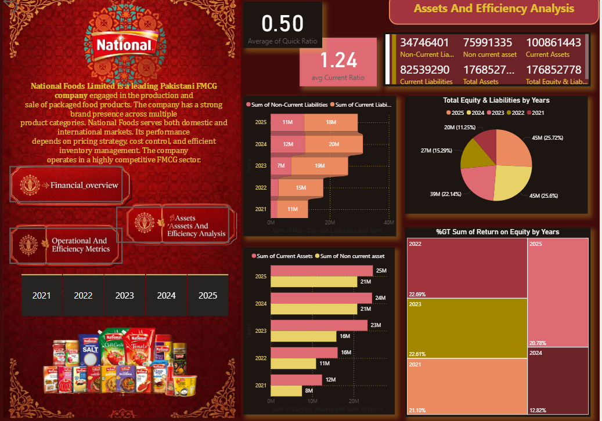
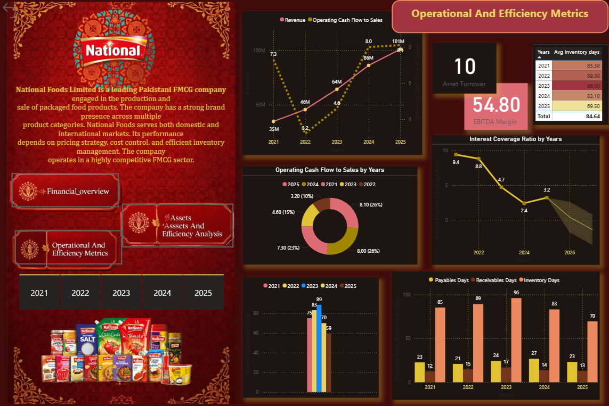

# Procom 2026 – National Foods Limited Financial Performance Dashboard

## Overview
This project was developed for the **Procom 2026 Analytics Competition** using financial data from **National Foods Limited**.  
The dashboard provides interactive insights into company performance through KPI tracking, trend analysis, and business intelligence visualizations.

The solution focuses on:
- Data Cleaning & Transformation
- Automated ETL Process
- Financial KPI Analysis
- Interactive Power BI Dashboard Design
- Business Insight Generation

Achieved **Runner-Up (2nd Position)** in the competition.

---

# Dashboard Preview

## Executive Dashboard

## Financial Trend Analysis

## KPI & Performance Insights

---

# Features
- Interactive Power BI Dashboard
- Automated ETL Pipeline using Power Query
- Revenue & Profit Analysis
- KPI Monitoring & Performance Tracking
- Financial Trend Visualization
- Professional and User-Friendly UI

---

# Technologies Used
- Power BI
- Power Query
- Microsoft Excel
- Data Analytics
- Business Intelligence

---

# Key Insights
- Identified top-performing business segments
- Analyzed revenue and profit growth trends
- Compared financial performance across categories
- Generated actionable business insights
- Improved decision-making through data visualization

---

# Achievement
Runner-Up (2nd Position) – Procom 2026 Analytics Competition

---

# Author
**Shahana Jamal**  
Data Analyst | Power BI Developer | Business Intelligence Enthusiast
